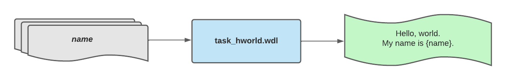
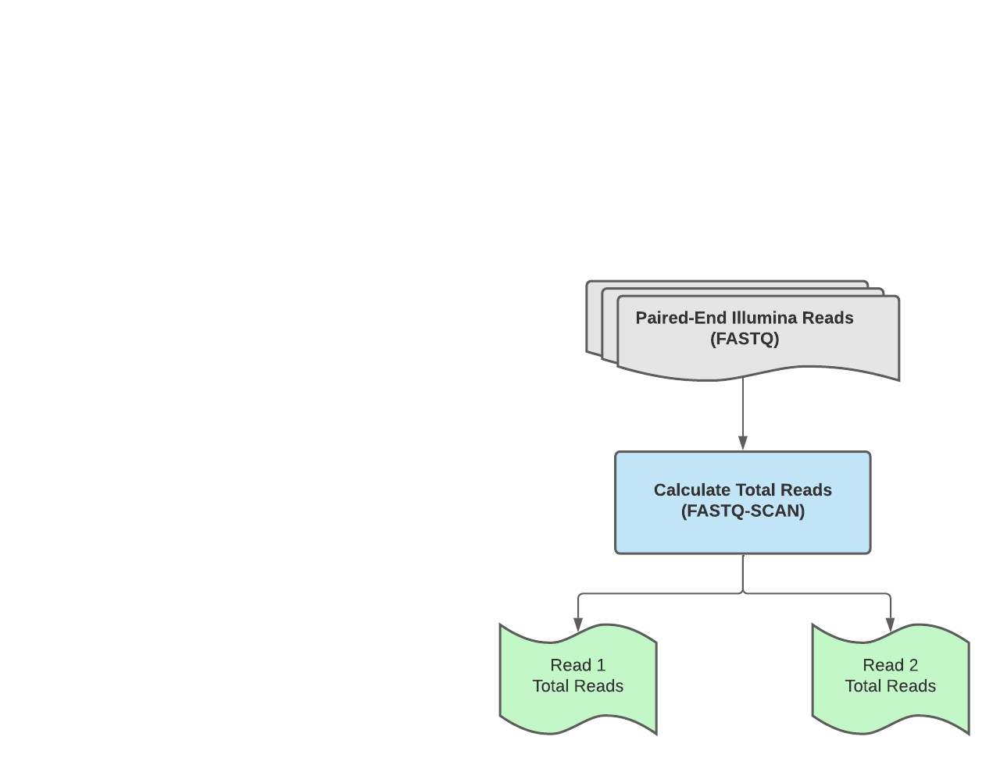

# Exercise 01: Creating a WDL Workflow

In this exercise, trainees will learn how to write a single-task WDL workflow and how to use miniwdl to run this workflow locally. 

**Exercise Objective**: Create a WDL workflow to capture the total number of reads in a fastq file using fastq-scan. 
- Part 1: Exploring fastq-scan to calculate total number of reads in a fastq file
- Part 2: Writing a WDL task and workflow to capture this functionality  

## Part 1 - Exploring FASTQ-SCAN
**1.1:** From your training VM, launch an interactive docker container using the StaPH-B Docker Image for fastq-scan version 0.4.4: `docker run --rm -it -v ~/wm_training/data/:/data staphb/fastq-scan:0.4.4`.

**1.2:** Use the [fastq-scan documentation](https://github.com/rpetit3/fastq-scan/blob/master/README.md) and the read data within the container to write a one-liner that:
- Calcaultes the total number of reads within a gzipped fastq file and 
- Writes this value (INT) to a file called `TOTAL_READS`

## Part 2 - Writing a WDL Task and Workflow<br />

**2.1:** Use the `miniwdl run` command to execute the `hworld` WDL workflow hosted in this repository:<br />
  `$ miniwdl run ~/wm_training/wdl/workflows/wf_hworld.wdl -i ~/wm_training/data/exercise_01/hworld_inputs.json`

<p align="center">
  
</p>

**2.2:** Modify the workflow input file (`~/wm_training/data/hworld/hworld_inputs.json`) to print your name.

```
 $ cat ~/wm_training/wdl/data/hwrold/hworld_inputs.json
 {
  "hworld_workflow.name": "Kevin G. Libuit"
 }
```

**2.3:** Use the WDL workflow and task template files (`~/wm_training/wdl/workflows/wf_template.wdl` & `~/wm_training/wdl/tasks/wf_task.wdl`) to write a single-task WDL workflow that takes in paired-end fastq files (`read1` & `read2`) and uses `fastq-scan` to calcaulte the total reads within each fastq file:

<p align="center">
  
</p>

## Hints and Solutions
<details>
 <summary> 1.2 Hint
 </summary><br />
 
 The total number of reads is captured as `qc_stats.read_total` in the `fastq-scan` output json file. The [`jq`](https://stedolan.github.io/jq/) is a powerful resources included in the `staphb/fastq-scan:0.4.4` [Dockerfile](https://github.com/StaPH-B/docker-builds/blob/master/fastq-scan/0.4.4/Dockerfile#L20) capable of parsing JSON files for specific outputs.
 
 Check out the [fastq-scan StaPH-B Docker Builds README.md](https://github.com/StaPH-B/docker-builds/tree/master/fastq-scan/0.4.4) before seeing the final solution!

</details>

<details>
 <summary> 1.2 Solution 
 </summary><br />   

One approach could be to concatenate the gzipped fastq file with `zcat`, pipe it into fastq-scan, and then pipe fastq-scan json output into the `jq` tool to query for `qc_stats.read_total`:<br />
   
`$ zcat {read_file} |  fastq-scan | jq .qc_stats.read_total > TOTAL_READS`

</details>

<details>
 <summary> 2.2 Hint
 </summary><br />
 
 How does the hworld_inputs.json file define the `name` input attribute?

</details>

<details>
  <summary> 2.2 Solution 
   </summary><br />

   By modifying the string `"Kevin G. Libuit"` the input file can be modified to print any name, *e.g.*:<br />

```
 $ cat ~/wm_training/wdl/data/hwrold/hworld_inputs.json
 {
  "hworld_workflow.name": "John Doe"
 }
```

</details>

<details>
 <summary> 2.3 Hint
 </summary><br />
 
Here's a potential start to  `task_fastq_scan.wdl` file:

```
task fastq_scan_task {
  meta {
    # task metadata
    description: "Task to run fastq_scan"
  }
  input {
    # task inputs
    File read1
    File read2
    String docker = "staphb/fastq-scan:0.4.4"
    Int cpu = 2
    Int memory = 2
  }
```

With these input attributes, how can we construct a `command` block to execute the appropriate `fastq-scan` command? What information needs to be defined in the `runtime` block?

</details>

<details>
  <summary> 2.3 Solution 
  </summary><br />
  
Check the following files in the [`solutions` branch](https://github.com/theiagen/wm_training/tree/solutions) of this repository: 
  - [`wm_training/wdl/tasks/task_fastq_scan.wdl`](https://github.com/theiagen/wm_training/blob/solutions/wdl/tasks/task_fastq_scan.wdl)
  - [`wm_training/wdl/workflows/wf_fastq_scan.wdl`](https://github.com/theiagen/wm_training/blob/solutions/wdl/workflows/wf_fastq_scan.wdl)

</details>
