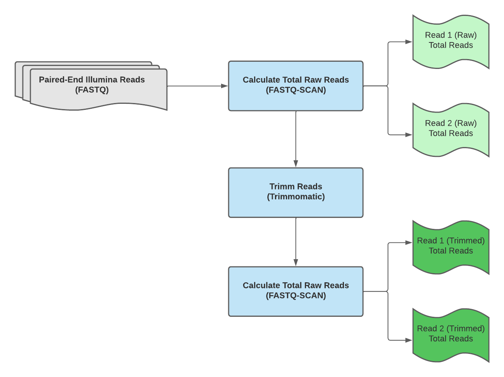

# Exercise 02: Multi-Task WDL Workflows

In this exercise, trainees will learn how to chain multiple tasks in a single WDL workflow. 

**Exercise Objective**: Create a WDL workflow that calculates the total number of reads in a fastq file before and after read trimming. 
- Part 1: Exploring the foo-bar_workflow to understand task interactions within a WDL workflow
- Part 2: Writing a multi-task WDL workflow with `trimmomatic` and `fastq-scan`

## Part 1 - Exploring the FOO-BAR WDL Workflow
**1.1:** If the `foo_task` multiplies `some_number` by `3` and the `bar_task` subtracts `25` from `some_number`, what will the workflow outputs of the `foobar_workflow` be if `some_number` = `5`?
<details>
  <summary> foo_task
  </summary><br />
  
```
task foo_task {
  meta {
    # task metadata
    description: "Foo task file: multiply some number by 3"
  }
  input {
    # task inputs
    Int some_number
    String docker = "quay.io/theiagen/utility:1.2"
    Int cpu = 2
    Int memory = 2
  }
  command <<<
    # code block executed 
    let "foo_number = ~{some_number} * 3"
    echo $foo_number | tee FOO_NUMBER
  >>>
  output {
    # task outputs
    Int foo_number = read_string("FOO_NUMBER")
  }
  runtime {
    # runtime environment
    docker: "~{docker}"
    memory: "~{memory} GB"
    cpu: cpu
    disks: "local-disk 50 SSD"
    preemptible: 0
  }
}
```

</details>
  
<details>
  <summary> bar_task
  </summary><br />
  
```
task bar_task {
  meta {
    # task metadata
    description: "Bar task file: subtract 25 from some number"
  }
  input {
    # task inputs
    Int some_number
    String docker = "quay.io/theiagen/utility:1.2"
    Int cpu = 2
    Int memory = 2
  }
  command <<<
    # code block executed 
    let "bar_number = ~{some_number} - 25"
    echo $bar_number | tee BAR_NUMBER
  >>>
  output {
    # task outputs
    Int bar_number = read_string("BAR_NUMBER")
  }
  runtime {
    # runtime environment
    docker: "~{docker}"
    memory: "~{memory} GB"
    cpu: cpu
    disks: "local-disk 50 SSD"
    preemptible: 0
  }
}
```

</details>
  
</details>
  
<details>
  <summary> foobar_workflow
  </summary><br />
  
```
workflow foobar_workflow {
  input {
    # workflow inputs
    Int some_number
  }
  # tasks and/or subworkflows to execute
  call foo.foo_task {
    input:
      some_number = some_number
  }
  call bar.bar_task {
    input:
      some_number = foo_task.foo_number
  }
  call foo.foo_task as second_foo_task {
    input:
      some_number = bar_task.bar_number
  }
  output {
    # workflow outputs (output columns in Terra data tables)
    Int foo_number = foo_task.foo_number
    Int bar_number = bar_task.bar_number
    Int second_foo_number = second_foo_task.foo_number
  }
}
```

</details>

- `foo_number`: ____
- `bar_number`: ____
- `second_foo_number`: ____

Use the `miniwdl run` command to execute the `wf_foobar.wdl` workflow hosted in this repository to calculate the value of `foo_number`, `bar_number`, and `second_foo_number` if `some_number` = `17`, `29`, and `184`.
  

## Part 2 - Writing a Multi-Task WDL workflow
**2.1:** From your training VM, launch an interactive docker container using the StaPH-B Docker Image for trimmomatic version 0.39: `docker run --rm -it -v ~/wm_training/data/:/data staphb/trimmomatic:0.39`.

**2.2:** Use the [trimmomatic documentation](http://www.usadellab.org/cms/?page=trimmomatic) to write a `trimmomatic_task` file that trims paired-end read data; `minlen`, `window_size`, and `required_quality` should be modifiable input attributes (default: `minlen` = `75`, `window_size` = `10`, `required_quality` = `20`)

**2.3:** Use the WDL workflow and task template files (`~/wm_training/wdl/workflows/wf_template.wdl` & `~/wm_training/wdl/tasks/wf_task.wdl`) to write a multi-task WDL workflow that takes in paired-end fastq files (`read1` & `read2`) and uses `fastq-scan` and `trimmomatic` to calculate the total paired reads within each fastq file before and after read tirmming:

<p align="center">
  
</p>

## Hints and Solutions
<details>
 <summary> 1.1 Hint
 </summary><br />
 
 Examine the `foobar_workflow` to see how the `some_number` input attribute of each workflow gets set, e.g.

  ```
   call foo.foo_task as second_foo_task {
    input:
      some_number = bar_task.bar_number
  }
  ```
  
  How might this impact the final workflow output?
</details>

<details>
 <summary> 1.1 Solution 
 </summary><br />   
  
 Use the `miniwdl run` command to execute the `foobar` WDL workflow hosted in this repository to find out:<br />

   `$ miniwdl run ~/wm_training/wdl/workflows/wf_foobar.wdl some_number=5`
  
If `some_number` = `5`:
 - `foo_number` = `5 * 3` = `15`
 - `bar_number` = `15 - 25` = `-10`
 - `second_foo_number`: = `-10 * 3` = `-30`

  
  ```
workflow foobar_workflow {
  input {
    # workflow inputs
    Int some_number = 5
  }
  # tasks and/or subworkflows to execute
  call foo.foo_task {
    input:
      some_number = some_number # some_number = 5
  }
  call bar.bar_task {
    input:
      some_number = foo_task.foo_number # foo_task.foo_number = 5 * 3 = 15
  }
  call foo.foo_task as second_foo_task {
    input:
      some_number = bar_task.bar_number # bar_task.bar_number = 15 - 25 = -10
  }
  output {
    # workflow outputs (output columns in Terra data tables)
    Int foo_number = foo_task.foo_number # foo_task.foo_number = 5 * 3 = 15
    Int bar_number = bar_task.bar_number # bar_task.bar_number = 15 - 25 = -10
    Int second_foo_number = second_foo_task.foo_number # bar_task.bar_number = -10 * 3 = -30
  }
}
  ```
  
</details>

<details>
 <summary> 2.2 Hint
 </summary><br />
 
Examine how this problem is addressed in other Theiagen GitHub repositories: 
  - [Public Health Bacterial Genomics](https://github.com/theiagen/public_health_bacterial_genomics/blob/main/tasks/quality_control/task_trimmomatic.wdl#L3)
  - [Public Health Viral Genomics](https://github.com/theiagen/public_health_viral_genomics/blob/main/tasks/task_read_clean.wdl#L157)

</details>

<details>
  <summary> 2.2 Solution 
   </summary><br />

Check the following files in the [`solutions` branch](https://github.com/theiagen/wm_training/tree/solutions) of this repository:
  - [`wm_training/wdl/tasks/task_trimmomatic.wdl`](https://github.com/theiagen/wm_training/blob/solutions/wdl/tasks/task_trimmomatic.wdl)
  
  
  
</details>

<details>
 <summary> 2.3 Hint
 </summary><br />
 
The `fastq_scan_task` will need to be called twice in this workflow. Examine the `foobar_workflow` to identify how a workflow can be called multiple times while avoiding any `task` namespace conflicts.

```
workflow foobar_workflow {
  input {
    # workflow inputs
    Int some_number
  }
  # tasks and/or subworkflows to execute
  call foo.foo_task {
    input:
      some_number = some_number
  }
  call bar.bar_task {
    input:
      some_number = foo_task.foo_number
  }
  call foo.foo_task as second_foo_task {
    input:
      some_number = bar_task.bar_number
  }
  output {
    # workflow outputs (output columns in Terra data tables)
    Int foo_number = foo_task.foo_number
    Int bar_number = bar_task.bar_number
    Int second_foo_number = second_foo_task.foo_number
  }
}
```

With these input attributes, how can we construct a `command` block to execute the appropriate `fastq-scan` command? What information needs to be defined in the `runtime` block?

</details>

<details>
  <summary> 2.3 Solution 
  </summary><br />
  
Check the following files in the [`solutions` branch](https://github.com/theiagen/wm_training/tree/solutions) of this repository: 
  - [`wm_training/blob/solutions/wdl/workflows/wf_scan_n_trim`](https://github.com/theiagen/wm_training/blob/solutions/wdl/workflows/wf_scan_n_trim.wdl)
  
</details>
