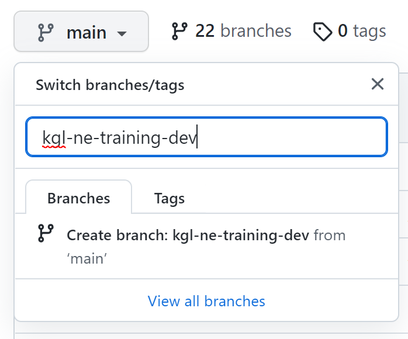

-----

  
  <b>NOTE: This exercise requires write access to this repository which has only been granted to registered trainees. </b>

-----

# Exercise 03: Connecting WDL Workflows to the Terra.Bio Platform

In this exercise, trainees will learn how to configure a dockstore.yml file to publish WDL workflows on Dockstore, making them acecssible through Terra.

**Exercise Objective**: Publish your Week 2 exercise solution to Dockstore to enable access through Terra. 
- Part 1: Create a dev branch on the wm_training repository and push all Week 2 solutions to this branch
- Part 2: Write a .dockstore.yml file to host your workflow on the Theiagen Dockstore account.
- Part 3: Run your Week 2 solutions from the Terra platform

## Part 1 - Creating a dev branch on the wm_training repository
**1.1:** Registered trainees will have the ability to create a branch directly from `main`; please use the branch naming convention of `{initials}-{training_cohort}-dev`, e.g. `kgl-ne-training-dev`:

  

  